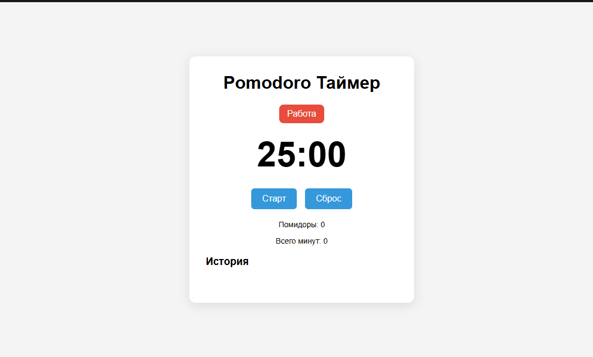

Курсовой проект: Таймер Pomodoro

Описание:
Таймер работает по схеме 25 минут работы - 5 минут отдыха.
Есть кнопки Старт/Пауза, Сброс.
Сохраняется количество помидоров, общее время, история.
Данные в localStorage.

Как запустить:
1. скачать с githab
2. Открыть index.html в браузере

Функции:
- таймер 25/5 мин
- звук и alert при завершении
- статистика помидоров
- история по дням
- адаптивный дизайн
- сохранение между сеансами

Технологии:
HTML CSS JS
localStorage
setInterval Date.now()

Структура:
index.html
style.css
script.js
sound.mp3

